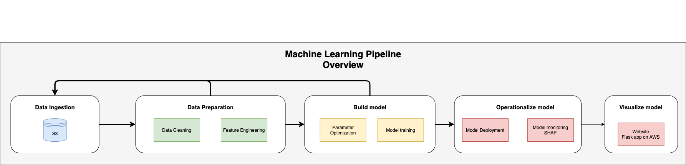
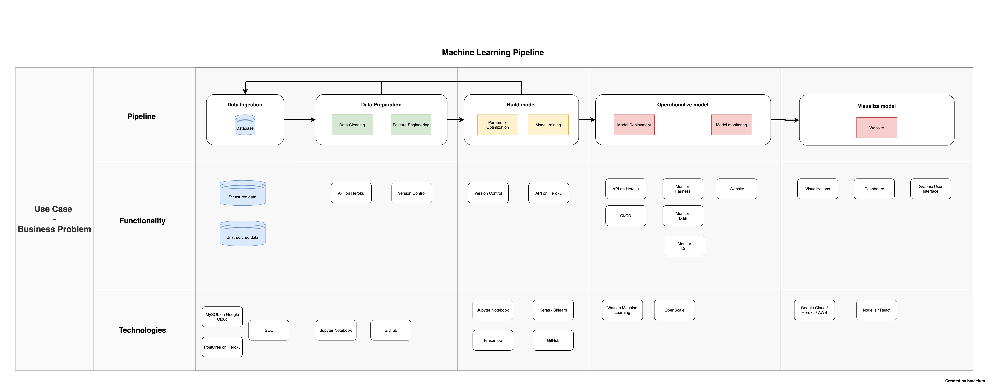
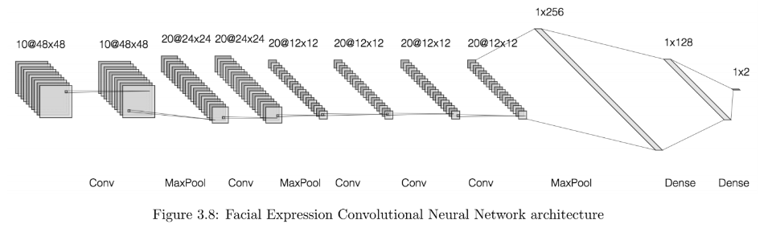
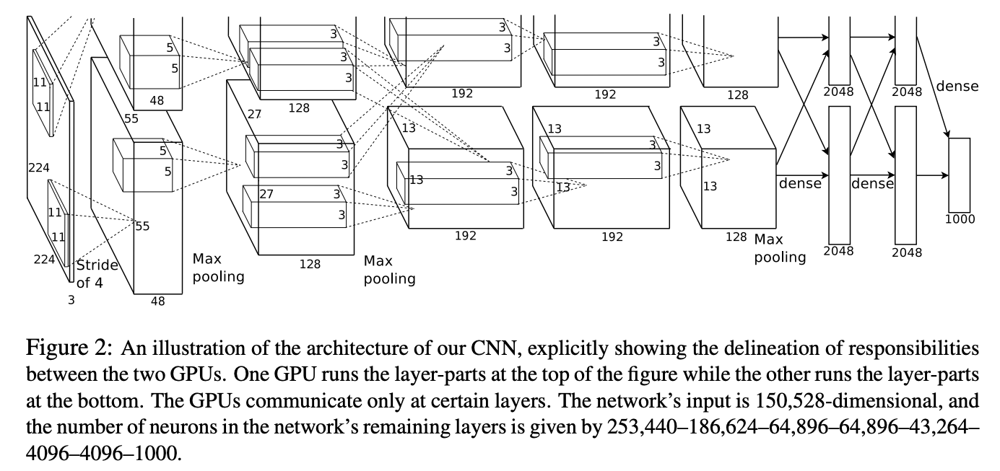

# Image Understanding 
K.I.S.S. Keep It Simple Stupid.   
Reusing architecture for intention classification. The goal is to analyze the result and come up with ideas on what can be improved. 

## Architecture Overview

  

### Sample Architectures

**Machine Learning Pipeline**

  

## Machine Learning Architectures
**Intention Classification Architecture**

  

Source:   
- MSc Dissertation https://www.dropbox.com/s/4h1am0xqd3xizbv/MSc_Robotics_BjornarMaelum.pdf?dl=0
- Repo: https://github.com/bmaelum/Intention-Classification

**ImageNet Architecture**

  

Source: ImageNet paper http://papers.nips.cc/paper/4824-imagenet-classification-with-deep-convolutional-neural-networks.pdf. 

## Authors

* **Bjørnar Kjenaas Mælum** - [bmaelum](https://github.com/bmaelum)

## License

This project is licensed under the MIT License - see the [LICENSE.md](LICENSE.md) file for details
